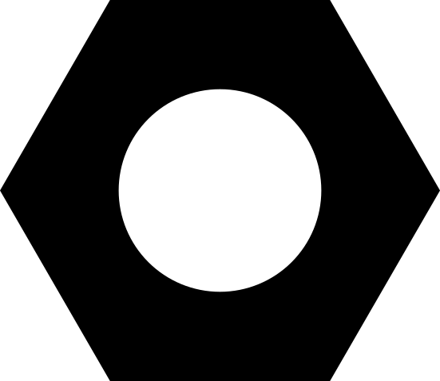
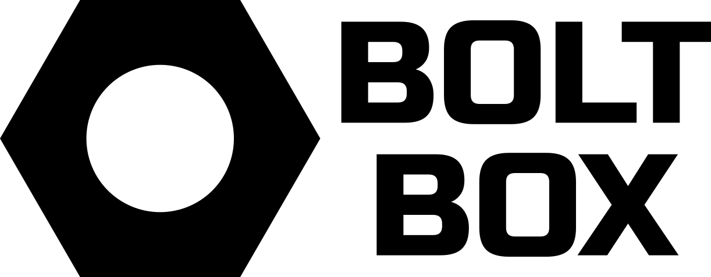

<a name="readme-top"></a>

[![Contributors][contributors-shield]][contributors-url]
[![Forks][forks-shield]][forks-url]
[![Stargazers][stars-shield]][stars-url]
[![Issues][issues-shield]][issues-url]
[![MIT License][license-shield]][license-url]

<!-- PROJECT LOGO -->
<br />
<div align="center">
  <a href="https://github.com/BurntIce16/BoltBox">
    
  </a>

  <h3 align="center">BoltBox</h3>

  <p align="center">
    A modular party game engine inspired by Jackbox
    <br />
    <a href="https://github.com/BurntIce16/BoltBox"><strong>Explore the docs »</strong></a>
    <br />
    <br />
    <a href="https://github.com/BurntIce16/BoltBox/issues">Report Bug</a>
    ·
    <a href="https://github.com/BurntIce16/BoltBox/issues">Request Feature</a>
  </p>
</div>

<!-- ABOUT THE PROJECT -->

## About The Project

<div align="center">
  
</div>

My friends and I loved playing jackbox, however we found ourselves contemplating new game types that could be added, and were met with a lack of resources to easily and quickly implement them, enter BoltBox.

BoltBox is complex under the hood but makes implementing games easy and quick:

- New games can be remotely installed using NPM
- All games can have extensions installed adding new content to the (extra lines or promts for example)
- Keep game devolpement simple and fun while being extendable and modular

This project is still heavily under devolpement and has a long way to go so help and patience is highly appreciated!

<p align="right">(<a href="#readme-top">back to top</a>)</p>

<!-- GETTING STARTED -->

## Getting Started

The installiation process for BoltBox should be as painless as possile and will hopefully get even easier in the future.
To get a local copy up and running follow these simple example steps.

### Prerequisites

This is an example of how to list things you need to use the software and how to install them.

- npm
  ```sh
  npm install npm@latest -g
  ```

### Installation

1. Clone the repo
   ```sh
   git clone https://github.com/BurntIce16/BoltBox.git
   ```
2. Install NPM packages
   ```sh
   npm install
   ```
3. Launch the BoltBox server
   ```sh
   npm start;
   ```
4. Connect the "host" machine to the server at port 3001 and follow the onscreen instructions
5. Destroy your friendships 😈

<p align="right">(<a href="#readme-top">back to top</a>)</p>

<!-- USAGE EXAMPLES -->

## Usage

Use this space to show useful examples of how a project can be used. Additional screenshots, code examples and demos work well in this space. You may also link to more resources.

_For more examples, please refer to the [Documentation](https://example.com)_

<p align="right">(<a href="#readme-top">back to top</a>)</p>

<!-- ROADMAP -->

## Roadmap

- [x] Basic local networking
- [x] Implement client interface
- [ ] Implement host interface
- [ ] Design and implement modular framework for NPM based game installiation
- [ ] Multi-language Support
  - [ ] French
  - [ ] Spanish
- [ ] Built in game browser through NPM

See the [open issues](https://github.com/BurntIce16/BoltBox/issues) for a full list of proposed features (and known issues).

<p align="right">(<a href="#readme-top">back to top</a>)</p>

<!-- LICENSE -->

## License

Distributed under the MIT License.

<p align="right">(<a href="#readme-top">back to top</a>)</p>

<!-- CONTACT -->

## Contact

Clayton Midgley - [@BurntIce16](https://twitter.com/BurntIce16) - clayton.midgley@gmail.com

Project Link: [https://github.com/BurntIce16/BoltBox](https://github.com/BurntIce16/BoltBox)

<p align="right">(<a href="#readme-top">back to top</a>)</p>

<!-- MARKDOWN LINKS & IMAGES -->
<!-- https://www.markdownguide.org/basic-syntax/#reference-style-links -->

[contributors-shield]: https://img.shields.io/github/contributors/BurntIce16/BoltBox?style=for-the-badge
[contributors-url]: https://github.com/BurntIce16/BoltBox/graphs/contributors
[forks-shield]: https://img.shields.io/github/forks/BurntIce16/BoltBox?style=for-the-badge
[forks-url]: https://github.com/BurntIce16/BoltBox/network/members
[stars-shield]: https://img.shields.io/github/stars/BurntIce16/BoltBox?style=for-the-badge
[stars-url]: https://github.com/BurntIce16/BoltBox/stargazers
[issues-shield]: https://img.shields.io/github/issues/BurntIce16/BoltBox?style=for-the-badge
[issues-url]: https://github.com/BurntIce16/BoltBox/issues
[license-shield]: https://img.shields.io/npm/l/boltbox?style=for-the-badge
[license-url]: https://opensource.org/license/mit/
